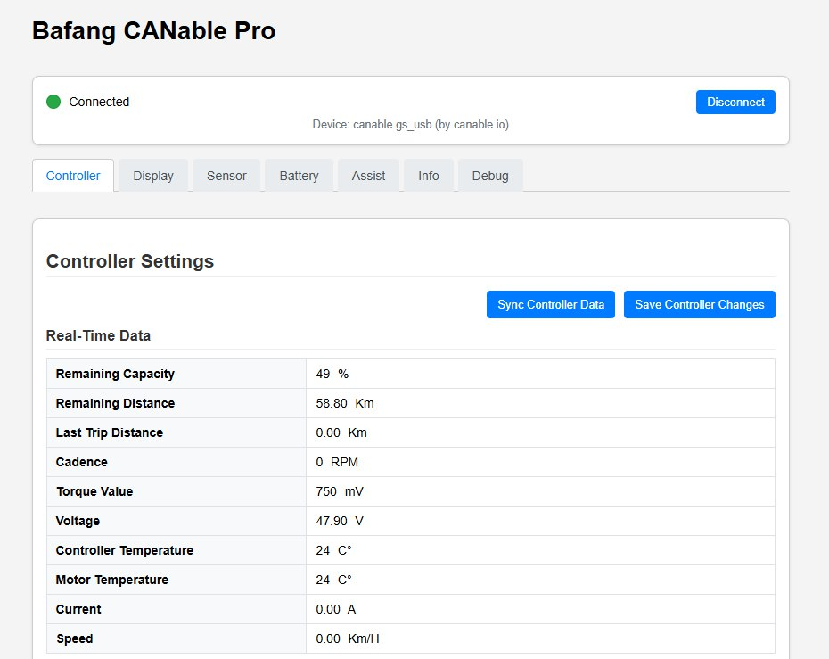
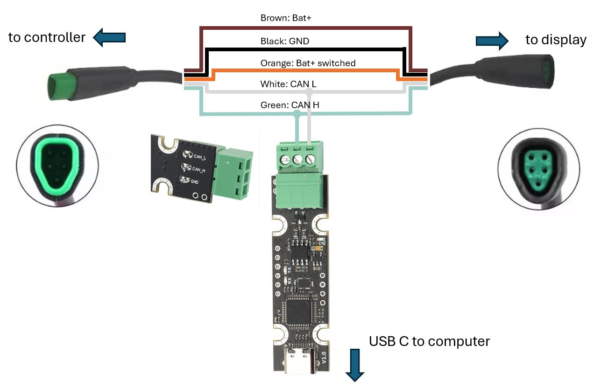

# Bafang Besst software replacement for M500, M510, M560, M820 etc  

# Steps to run the software

## Get hardware 
 - Canable with STM32F072 processor and candlelight firmware ([Ebay](https://www.ebay.com/itm/156316405598),[Aliexpress](https://pl.aliexpress.com/item/1005006029234562.html))
 - 5 pin Cable with male and famale plugs ([Ebay](https://www.ebay.com/itm/197421023105),[Aliexpress](https://pl.aliexpress.com/item/1005005307670708.html))

## Wire the Canable (UCAN module example)

## Run the software from executable
- Download and run last [release](https://github.com/mdi-9/bafang_canable_pro/releases)
- Open [localhost:8080](http://localhost:8080)

## Or run the software from source code
- Install nodeJS and npm
- Download source code for last [release](https://github.com/mdi-9/bafang_canable_pro/releases)
- Unzip and open folder in terminal
- Run `npm install` in terminal to download all dependencies
- Run `node server.js` in terminal

## Optional: candlelight firmware flashing (in case of wrong module firmware or drives issues)
- Download last version of [candlelight firmware](https://github.com/candle-usb/candleLight_fw/releases)
- [Flash dowloaded firmware to the Canable device](https://canable.io/getting-started.html#flashing-new-firmware)
- Drives on windows and linux should be working plug&play

### License
This program is free software: you can redistribute it and/or modify it under the terms of the GNU General Public License as published by the Free Software Foundation, either version 3 of the License, or (at your option) any later version.
